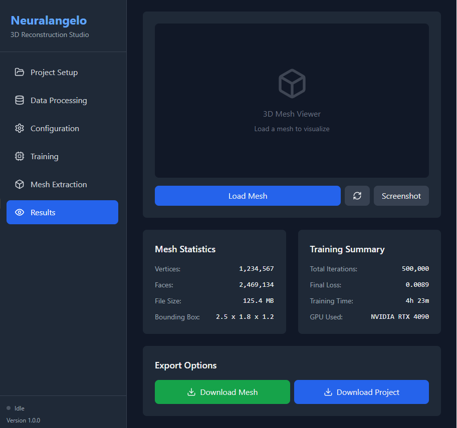
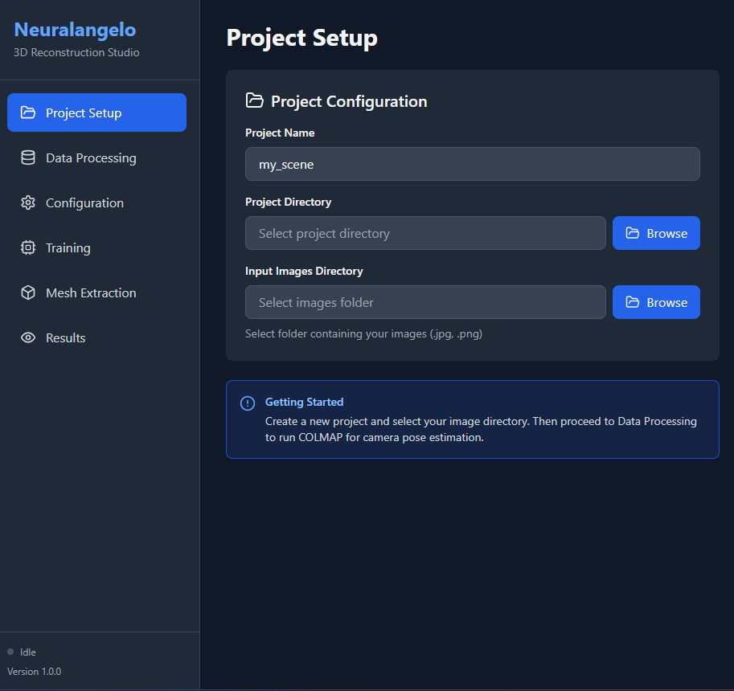
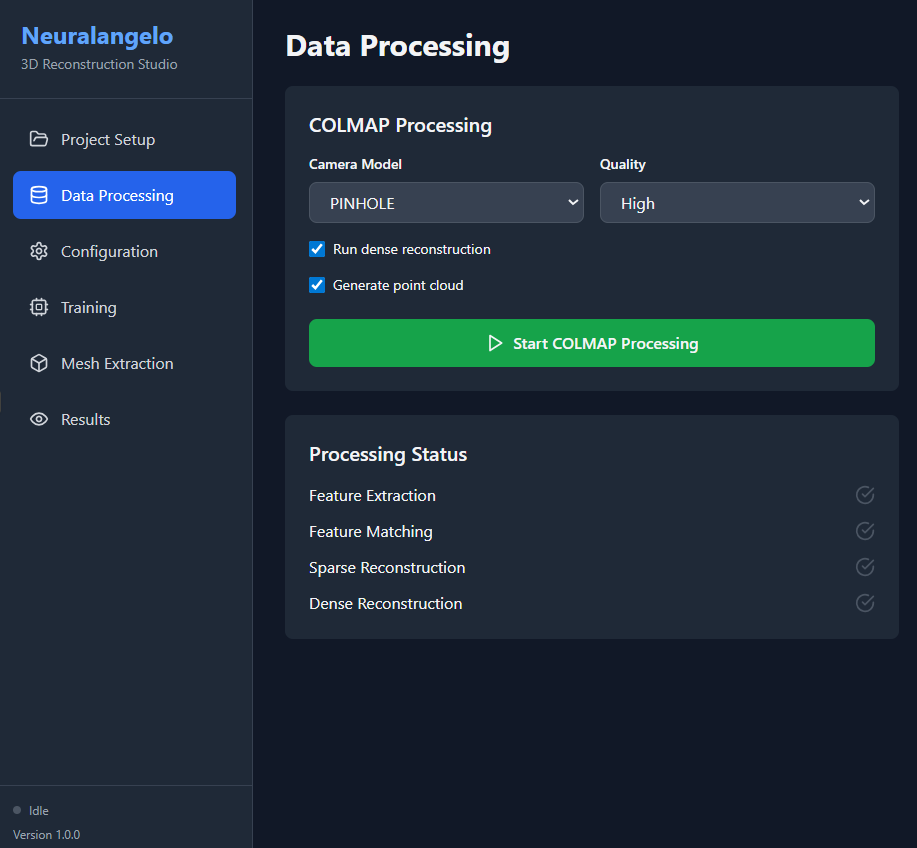
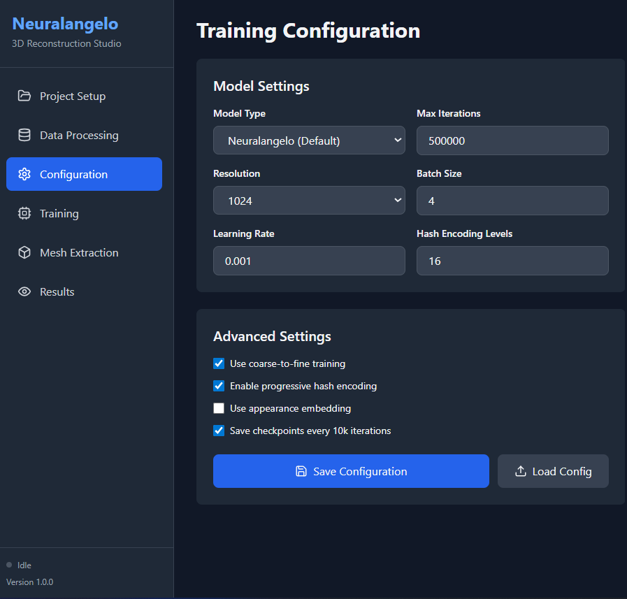
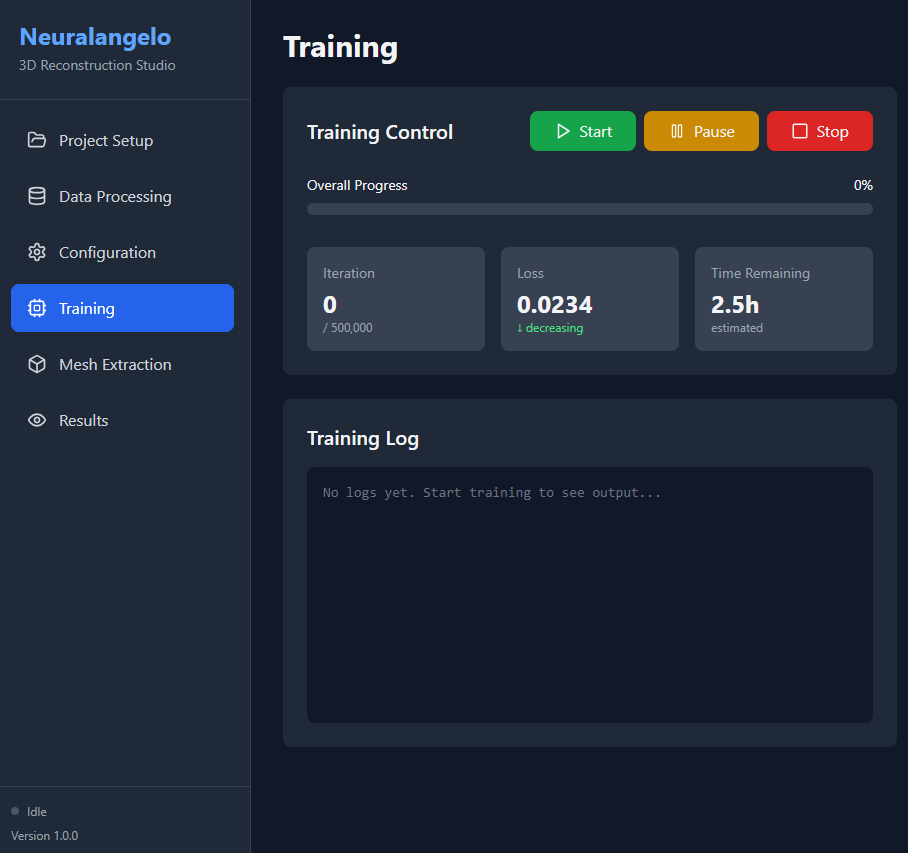
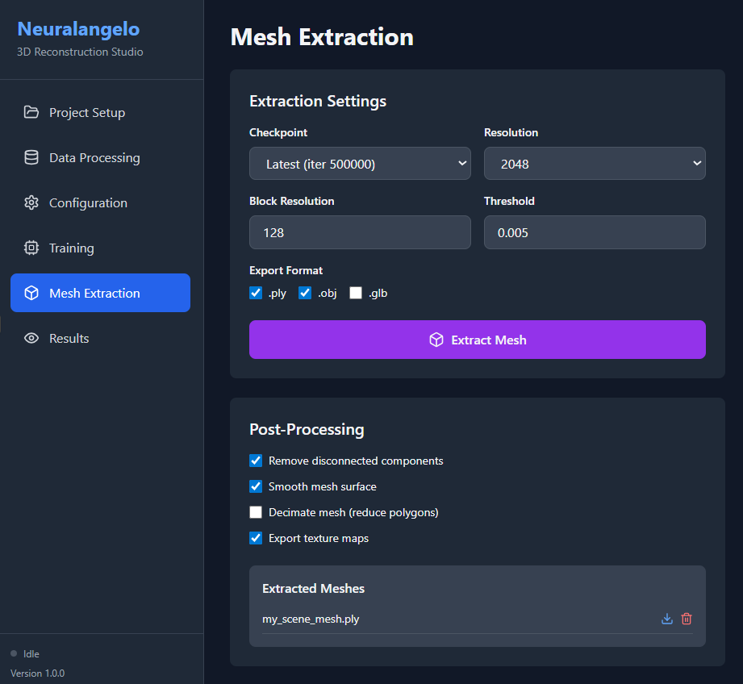

# Neuralangelo GUI - 3D Reconstruction Studio

<div align="center">



**A comprehensive, user-friendly graphical interface for NVIDIA's Neuralangelo 3D reconstruction**

[](https://opensource.org/licenses/MIT)
[](https://reactjs.org/)
[](https://www.python.org/)
[](https://fastapi.tiangolo.com/)
[](http://makeapullrequest.com)

[Features](#features) • [Installation](#installation) • [Quick Start](#quick-start) • [Documentation](#documentation) • [Contributing](#contributing)

</div>

---

## 📖 Overview

Neuralangelo GUI is a complete, production-ready graphical interface for [NVIDIA's Neuralangelo](https://github.com/NVlabs/neuralangelo), making high-fidelity 3D surface reconstruction accessible to everyone—no command-line experience required!

This application provides an end-to-end workflow from image capture to 3D mesh export, handling:
- ✅ COLMAP camera pose estimation
- ✅ Neural training configuration and monitoring
- ✅ Real-time progress tracking via WebSocket
- ✅ Mesh extraction in multiple formats
- ✅ Project management and organization

**Perfect for:** Researchers, 3D artists, photographers, engineers, and anyone interested in creating 3D models from photos.

## ✨ Features

### 🎯 Core Functionality

#### **Project Management**
- Create and organize multiple reconstruction projects
- Save and load project configurations
- Browse recent projects with one click
- Persistent project state across sessions

#### **Data Processing**
- Automated COLMAP integration for camera pose estimation
- Multiple camera model support (PINHOLE, RADIAL, OPENCV)
- Quality presets (High, Medium, Low)
- Dense reconstruction and point cloud generation
- Real-time processing status updates

#### **Visual Configuration**
- Intuitive UI for all training parameters
- Model type selection (Neuralangelo, Instant-NGP)
- Adjustable resolution, batch size, learning rate
- Hash encoding level controls
- Advanced settings (coarse-to-fine, progressive encoding)
- Configuration save/load functionality

#### **Real-time Training**
- Live training progress monitoring via WebSocket
- Real-time loss tracking and visualization
- Iteration counter with ETA
- Training control (Start, Pause, Resume, Stop)
- Comprehensive logging with timestamps
- Checkpoint management

#### **Mesh Extraction**
- Multiple export formats (.ply, .obj, .glb)
- Adjustable extraction resolution
- Isosurface threshold control
- Post-processing options:
  - Remove disconnected components
  - Mesh smoothing
  - Polygon decimation
  - Texture map export

#### **Results Visualization**
- Mesh statistics display
- Training summary and metrics
- File management and downloads
- Project export capabilities

### 🚀 Technical Features

- **Backend:** FastAPI with async support
- **Frontend:** React 18 with Tailwind CSS
- **Real-time:** WebSocket communication
- **GPU Acceleration:** CUDA support for training
- **Containerization:** Docker with NVIDIA runtime
- **CI/CD:** GitHub Actions pipeline
- **Testing:** Comprehensive test suite
- **Documentation:** Full guides and API docs

## 📸 Screenshots

### Project Setup

*Create projects and upload images with an intuitive interface*

### Data Processing (COLMAP)

*Automated camera pose estimation with real-time status*

### Configuration

*Visual controls for all training parameters and advanced settings*

### Training Monitor

*Real-time training progress with live metrics and logs*

### Mesh Extraction

*Extract high-quality 3D meshes with post-processing options*

### Results Visualization

*View statistics and download your 3D reconstructions*

## 📋 Prerequisites

### Required Software

- **Operating System:** 
  - Ubuntu 20.04+ (recommended)
  - Windows 10/11 with WSL2
  - macOS (experimental)

- **Hardware:**
  - NVIDIA GPU with 12GB+ VRAM (RTX 3090, 4090, A5000, etc.)
  - 16GB+ RAM (32GB recommended)
  - 50GB+ free disk space

- **Software:**
  - Python 3.8 or higher
  - Node.js 16.x or higher
  - CUDA 11.3 or higher
  - COLMAP 3.8 or higher
  - Git

### Recommended GPU

| GPU Model | VRAM | Batch Size | Training Time (500k iter) |
|-----------|------|------------|---------------------------|
| RTX 3090 | 24GB | 8 | 2-3 hours |
| RTX 4090 | 24GB | 8 | 1.5-2 hours |
| RTX 3080 | 10GB | 4 | 3-4 hours |
| A5000 | 24GB | 8 | 2-3 hours |

## 🔧 Installation

### Quick Install (Recommended)

```bash
# Clone the repository
git clone https://github.com/photogbill/Neuralangelo_GUI.git
cd Neuralangelo_GUI

# Run the installation script (creates conda env, installs dependencies)
chmod +x scripts/install.sh
./scripts/install.sh
```

### Manual Installation

#### 1. Install System Dependencies

**Ubuntu/Debian:**
```bash
sudo apt-get update
sudo apt-get install -y \
    build-essential cmake git python3-pip \
    libboost-all-dev libeigen3-dev libfreeimage-dev \
    libmetis-dev libgoogle-glog-dev libgflags-dev \
    libsqlite3-dev libglew-dev qtbase5-dev \
    libqt5opengl5-dev libcgal-dev colmap
```

#### 2. Clone Repositories

```bash
# Clone this repository
git clone https://github.com/photogbill/Neuralangelo_GUI.git
cd Neuralangelo_GUI

# Clone Neuralangelo
git clone https://github.com/NVlabs/neuralangelo.git
```

#### 3. Set Up Python Environment

```bash
# Create conda environment
conda create -n neuralangelo python=3.8 -y
conda activate neuralangelo

# Install PyTorch (adjust for your CUDA version)
pip install torch==2.0.1+cu118 torchvision==0.15.2+cu118 --index-url https://download.pytorch.org/whl/cu118

# Install Neuralangelo dependencies
cd neuralangelo
pip install -r requirements.txt
pip install git+https://github.com/NVlabs/tiny-cuda-nn/#subdirectory=bindings/torch
cd ..

# Install backend dependencies
cd backend
pip install -r requirements.txt
cd ..
```

#### 4. Set Up Frontend

```bash
# Install Node.js dependencies
npm install
```

#### 5. Configure Environment

```bash
# Create backend .env file
cat > backend/.env << EOF
NEURALANGELO_PATH=./neuralangelo
COLMAP_PATH=/usr/bin/colmap
BACKEND_PORT=8000
GPU_DEVICES=0
EOF

# Create frontend .env file
cat > .env << EOF
VITE_API_URL=http://localhost:8000
VITE_WS_URL=ws://localhost:8000/ws
EOF
```

### Docker Installation (Alternative)

```bash
# Build and run with Docker Compose
docker-compose up --build

# Access at http://localhost:3000
```

## 🚀 Quick Start

### 1. Start the Application

**Terminal 1 - Backend:**
```bash
conda activate neuralangelo
cd backend
python server.py
```

**Terminal 2 - Frontend:**
```bash
cd Neuralangelo_GUI
npm run dev
```

**Open Browser:**
Navigate to `http://localhost:3000`

### 2. Create Your First Project

> 💡 **Tip:** See the [Screenshots](#screenshots) section above for visual guidance through each step.

1. **Project Setup Tab**
   - Enter project name: `my_first_scan`
   - Click "Select Images" and choose 30-50 photos
   - Click "Upload" then "Create Project"

2. **Data Processing Tab**
   - Select camera model (PINHOLE for most cameras)
   - Click "Start COLMAP Processing"
   - Wait 3-5 minutes for completion

3. **Configuration Tab**
   - For quick test: Set Max Iterations to `10000`
   - Keep other defaults
   - Click "Save Configuration"

4. **Training Tab**
   - Click "Start" to begin training
   - Monitor real-time progress
   - Wait for completion (2-4 hours for full quality)

5. **Mesh Extraction Tab**
   - Click "Extract Mesh"
   - Wait 1-2 minutes
   - Click "Download Mesh"

🎉 **You've created your first 3D reconstruction!**

For detailed instructions, see [QUICKSTART.md](QUICKSTART.md)

## 📁 Project Structure

```
Neuralangelo_GUI/
├── README.md                    # This file
├── INSTALLATION.md              # Detailed installation guide
├── QUICKSTART.md                # Quick start tutorial
├── CONTRIBUTING.md              # Contribution guidelines
├── CHANGELOG.md                 # Version history
├── LICENSE                      # MIT License
│
├── index.html                   # HTML entry point
├── package.json                 # Node.js dependencies
├── vite.config.js              # Vite configuration
├── tailwind.config.js          # Tailwind CSS config
├── postcss.config.js           # PostCSS config
├── docker-compose.yml          # Docker Compose config
├── Dockerfile                  # Docker container config
├── .env.example                # Environment template
├── .gitignore                  # Git ignore rules
│
├── src/                        # Frontend source
│   ├── main.jsx               # React entry point
│   ├── App.jsx                # Root component
│   ├── index.css              # Global styles
│   ├── components/
│   │   └── NeuralAngeloGUI.jsx  # Main GUI component
│   └── utils/
│       └── api.js             # API client
│
├── backend/                    # Python backend
│   ├── server.py              # FastAPI server
│   ├── colmap_wrapper.py      # COLMAP integration
│   ├── training_manager.py    # Training orchestration
│   ├── mesh_extractor.py      # Mesh extraction
│   ├── requirements.txt       # Python dependencies
│   ├── requirements-dev.txt   # Dev dependencies
│   ├── .env                   # Backend configuration
│   └── tests/
│       └── test_server.py     # Backend tests
│
├── neuralangelo/              # Neuralangelo (git clone)
├── projects/                  # User projects (auto-created)
├── logs/                      # Application logs
│
├── .github/
│   └── workflows/
│       └── ci.yml            # CI/CD pipeline
│
└── docs/                      # Additional documentation
```

## ⚙️ Configuration

### Training Parameters

| Parameter | Default | Range | Description |
|-----------|---------|-------|-------------|
| Max Iterations | 500,000 | 10k-1M | Training steps |
| Resolution | 1024 | 512-2048 | Image resolution |
| Batch Size | 4 | 1-16 | Samples per iteration |
| Learning Rate | 0.001 | 0.0001-0.01 | Optimization rate |
| Hash Levels | 16 | 8-24 | Encoding detail |

### COLMAP Settings

| Setting | Options | Recommended |
|---------|---------|-------------|
| Camera Model | PINHOLE, RADIAL, OPENCV | PINHOLE |
| Quality | High, Medium, Low | High |
| Dense Recon | On/Off | On |
| Point Cloud | On/Off | On |

### Mesh Extraction

| Parameter | Default | Description |
|-----------|---------|-------------|
| Resolution | 2048 | Marching cubes grid |
| Block Resolution | 128 | Memory chunks |
| Threshold | 0.005 | Isosurface level |

## 🎮 Usage Guide

### Photography Tips

**For Objects:**
- Use 36-72 images (every 5-10 degrees)
- Fixed lighting, no harsh shadows
- 60-80% overlap between images
- Disable auto-focus on camera
- Use turntable or walk around object

**For Scenes:**
- 50-150 images depending on size
- Multiple heights and angles
- Good coverage of all areas
- Avoid reflective surfaces
- Consistent lighting

### Quality vs. Speed

**Fast Test (10 minutes):**
- 20-30 images
- 10k iterations
- Resolution: 512
- Quality: ⭐⭐☆☆☆

**Balanced (45 minutes):**
- 50-70 images
- 100k iterations
- Resolution: 1024
- Quality: ⭐⭐⭐⭐☆

**High Quality (3-5 hours):**
- 80-150 images
- 500k iterations
- Resolution: 2048
- Quality: ⭐⭐⭐⭐⭐

## 🐛 Troubleshooting

### Common Issues

**"CUDA out of memory"**
```
Solution: Reduce batch size to 2 or resolution to 512
Config Tab → Batch Size: 2
```

**"COLMAP failed to process images"**
```
Solution: Check image overlap and quality
- Retake photos with more overlap (70-80%)
- Ensure images are in focus
- Try different camera model
```

**"Training loss not decreasing"**
```
Solution: Verify COLMAP succeeded and check settings
- Data Processing Tab → Check all green checkmarks
- Try lower learning rate (0.0001)
- Increase iterations
```

**"WebSocket connection failed"**
```
Solution: Ensure backend is running
Terminal 1: cd backend && python server.py
Check: http://localhost:8000 shows API message
```

**"Port already in use"**
```
Solution: Change port or kill existing process
# Windows: netstat -ano | findstr :8000
# Linux: lsof -ti:8000 | xargs kill -9
```

### Error Messages

| Error | Cause | Fix |
|-------|-------|-----|
| "Project not found" | Invalid project name | Check spelling, create new project |
| "No images uploaded" | Empty images folder | Upload images first |
| "Checkpoint not found" | Training not completed | Wait for training to finish |
| "GPU not available" | CUDA not installed | Install CUDA toolkit |

For more help:
- 📖 Check [INSTALLATION.md](INSTALLATION.md)
- 💬 Ask on [GitHub Discussions](https://github.com/photogbill/Neuralangelo_GUI/discussions)
- 🐛 Report bugs via [Issues](https://github.com/photogbill/Neuralangelo_GUI/issues)

## 🗺️ Roadmap

### Version 1.0 (Current)
- [x] Complete web-based GUI
- [x] COLMAP integration
- [x] Real-time training monitoring
- [x] Multi-format mesh export
- [x] Docker support
- [x] Comprehensive documentation

### Version 1.1 (Planned - Q2 2025)
- [ ] Interactive 3D mesh viewer (Three.js)
- [ ] Training visualization graphs
- [ ] Batch processing for multiple scenes
- [ ] Training presets (indoor, outdoor, object)
- [ ] Automatic quality estimation

### Version 1.2 (Planned - Q3 2025)
- [ ] Multi-GPU training support
- [ ] Texture map generation
- [ ] Video input processing
- [ ] Cloud training integration
- [ ] Mobile-responsive interface

### Version 2.0 (Future)
- [ ] Real-time reconstruction preview
- [ ] AR/VR mesh preview
- [ ] Collaborative projects
- [ ] Plugin system
- [ ] REST API for automation

## 🤝 Contributing

We welcome contributions! Please see [CONTRIBUTING.md](CONTRIBUTING.md) for guidelines.

### Ways to Contribute

- 🐛 **Report bugs** via [Issues](https://github.com/photogbill/Neuralangelo_GUI/issues)
- 💡 **Suggest features** via [Discussions](https://github.com/photogbill/Neuralangelo_GUI/discussions)
- 📖 **Improve documentation**
- 🔧 **Submit pull requests**
- 🌍 **Translate to other languages**
- 🎨 **Share your reconstructions**

### Development Setup

```bash
# Fork and clone
git clone https://github.com/YOUR_USERNAME/Neuralangelo_GUI.git
cd Neuralangelo_GUI

# Install dependencies
npm install
cd backend && pip install -r requirements-dev.txt

# Run tests
npm test
pytest backend/tests/

# Start development servers
npm run dev  # Frontend with hot reload
python backend/server.py  # Backend
```

### Code Style

- **Frontend:** ESLint + Prettier
- **Backend:** Black + Flake8
- **Commits:** Conventional Commits format
- **Tests:** Required for new features

## 📄 License

This project is licensed under the MIT License - see the [LICENSE](LICENSE) file for details.

### Third-Party Components

This software uses the following open-source components:

- **[Neuralangelo](https://github.com/NVlabs/neuralangelo)** - NVIDIA License
- **[COLMAP](https://github.com/colmap/colmap)** - BSD 3-Clause License
- **[PyTorch](https://github.com/pytorch/pytorch)** - BSD-style License
- **[React](https://github.com/facebook/react)** - MIT License
- **[FastAPI](https://github.com/tiangulo/fastapi)** - MIT License

Please review the licenses of these components before using this software for commercial purposes.

## 🙏 Acknowledgments

- **NVIDIA Research** for creating [Neuralangelo](https://research.nvidia.com/labs/dir/neuralangelo/)
- **COLMAP** team for camera pose estimation
- **PyTorch** and **React** communities
- All contributors and users of this project

## 📚 Citation

If you use this software in your research, please cite both this project and the original Neuralangelo paper:

```bibtex
@software{neuralangelo_gui,
  author = {photogbill},
  title = {Neuralangelo GUI: A User-Friendly Interface for 3D Reconstruction},
  year = {2025},
  url = {https://github.com/photogbill/Neuralangelo_GUI}
}

@inproceedings{li2023neuralangelo,
  title={Neuralangelo: High-Fidelity Neural Surface Reconstruction},
  author={Li, Zhaoshuo and M\"uller, Thomas and Evans, Alex and Taylor, Russell H and Unberath, Mathias and Liu, Ming-Yu and Lin, Chen-Hsuan},
  booktitle={IEEE Conference on Computer Vision and Pattern Recognition (CVPR)},
  year={2023}
}
```

## 📞 Contact & Support

- **GitHub:** [@photogbill](https://github.com/photogbill)
- **Repository:** [Neuralangelo_GUI](https://github.com/photogbill/Neuralangelo_GUI)
- **Issues:** [Bug Reports](https://github.com/photogbill/Neuralangelo_GUI/issues)
- **Discussions:** [Community Forum](https://github.com/photogbill/Neuralangelo_GUI/discussions)

### Getting Help

1. **Check Documentation:** [INSTALLATION.md](INSTALLATION.md), [QUICKSTART.md](QUICKSTART.md)
2. **Search Issues:** [Existing Issues](https://github.com/photogbill/Neuralangelo_GUI/issues?q=is%3Aissue)
3. **Ask Community:** [GitHub Discussions](https://github.com/photogbill/Neuralangelo_GUI/discussions)
4. **Report Bug:** [New Issue](https://github.com/photogbill/Neuralangelo_GUI/issues/new)

## 📊 Project Stats


---

<div align="center">

**Made with ❤️ for the 3D reconstruction community**

⭐ Star us on GitHub — it helps!

[Report Bug](https://github.com/photogbill/Neuralangelo_GUI/issues) • [Request Feature](https://github.com/photogbill/Neuralangelo_GUI/issues) • [Documentation](https://github.com/photogbill/Neuralangelo_GUI/wiki)

</div>
